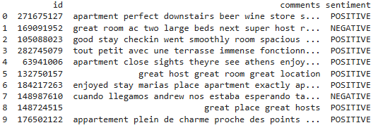
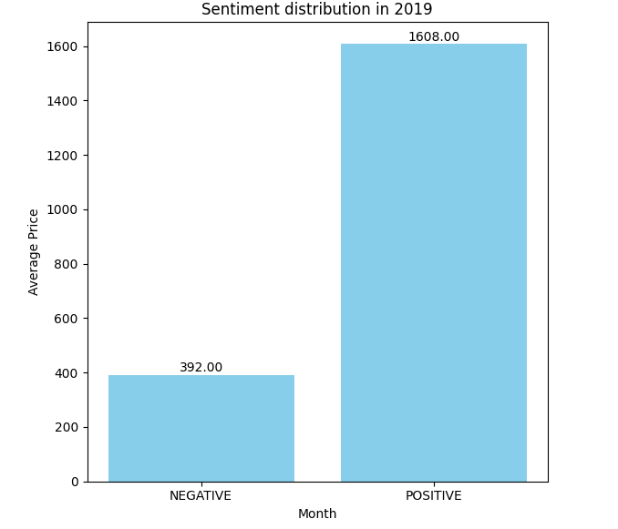
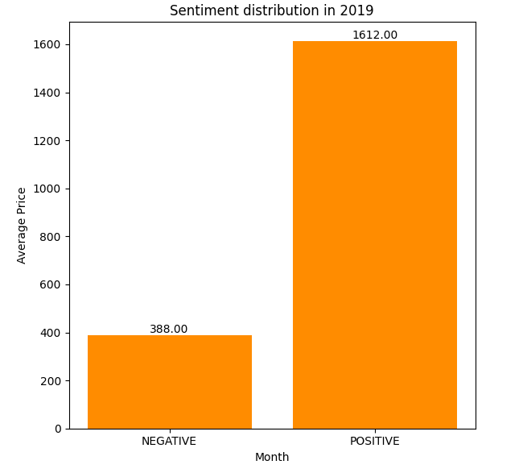
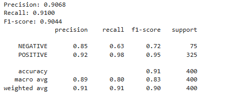
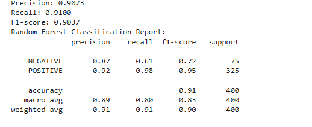
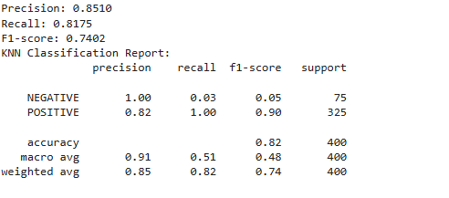
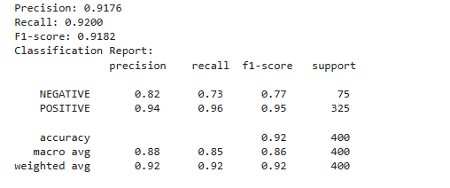
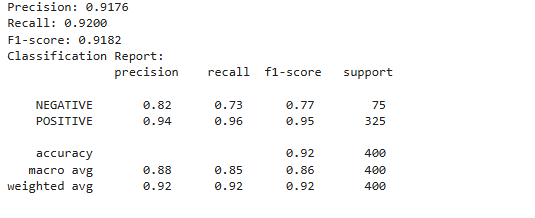
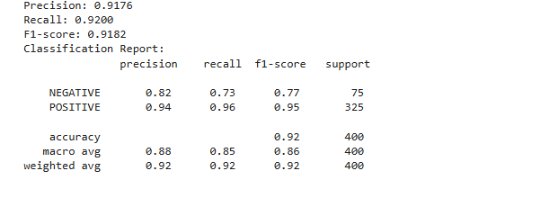

# Data-Mining-2-SVM-RandomForest-KNN
This notebook applies data mining techniques for sentiment analysis using K-Nearest Neighbors (KNN), Support Vector Machine (SVM), and Random Forest models. Precision, recall, and F1-score are calculated through 10-fold cross-validation, providing insight into model reliability and classification accuracy.

## Helper Functions

- Splits data into N folds and iterates over each, training the model on the training folds and evaluating it on the validation fold.
- Computes metrics like precision, recall, and F1-score for each fold, then averages these scores across folds to provide mean values and standard deviations.

```python
def NFoldVal(model, N, X, Y):
    kf = KFold(n_splits=N, shuffle=True, random_state=42)
    for fold, (train_index, val_index) in enumerate(kf.split(X)):
        X_train_fold, X_val_fold = X[train_index], X[val_index]
        model.fit(X_train_fold, Y_train_fold)
        # Predictions and metrics computation
```

## Preprocessing

- **Import Prerequisites:** Libraries are loaded for data handling (pandas), NLP tasks (nltk), model evaluation, and embedding (transformers, sklearn). Warnings are suppressed for cleaner output.

- **Text Cleaning and Tokenization:**
  - Stopwords are removed, punctuation is filtered, and text is tokenized. The cleaned text is vectorized using TF-IDF for numerical input to models.
  - GloVe embeddings provide dense vector representations, enhancing model accuracy by capturing semantic relationships.
 
```python
tokenizer = Tokenizer()
tokenizer.fit_on_texts(data['text_column'])
sequences = tokenizer.texts_to_sequences(data['text_column'])
word_index = tokenizer.word_index
```

## Annotate data with pretrained model

- Initializes a sentiment analysis pipeline and selects the 'comments' column from the sampled DataFrame for annotation.
- Annotates each comment, truncates it to 512 characters, and stores the sentiment label in a new column 'sentiment'.

```python
annotator = pipeline("sentiment-analysis")

comments_to_annotate = year2019_sample['comments']

annotations = []

for comment in comments_to_annotate:
    comment = comment[:512]
    annotation = annotator(comment)
    annotations.append(annotation)

year2019_sample.loc[:1999, 'sentiment'] = [annotation[0]['label'] for annotation in annotations]

print(year2019_sample.head(10))
```



## Sentiment Distribution

- Groups the sampled DataFrame by 'sentiment', counts occurrences, and resets the index to create a summary DataFrame.
- Plots a bar chart to visualize the distribution of sentiments, adding labels to each bar and displaying the plot.

```python
temp = year2019_sample.groupby('sentiment').count().reset_index()

plt.figure(figsize=(6, 6))
plt.bar(temp['sentiment'], temp['comments'], color='skyblue')
plt.xlabel('Month')
plt.ylabel('Average Price')
plt.title('Sentiment distribution in 2019')

for i, price in enumerate(temp['comments']):
    plt.text(i, price + 0.5, f'{price:.2f}', ha='center', va='bottom')

plt.ylim(bottom=0)
plt.tight_layout()
plt.show()
```




## TF-IDF Vectorization

- **Train-Test Split:** Data is divided into training and test sets with a standard 80-20 split.
- Initializes a TF-IDF vectorizer with English stopwords and transforms the training data into TF-IDF vectors.
- Transforms the test data too into TF-IDF vectors and prints the shape of the resulting training and test matrices.


```python
vectorizer = TfidfVectorizer(stop_words='english')

X_train_vectors_2019 = vectorizer.fit_transform(X_train_2019)

X_test_vectors_2019 = vectorizer.transform(X_test_2019)

print("X train vector shape: " , X_train_vectors_2019.shape)
print("Y train vector shape: " , X_test_vectors_2019.shape)
```

- **SVM**
    - Trains an SVM model with a linear kernel on the TF-IDF vectorized training data and makes predictions on the test data.
    - Calculates and prints precision, recall, and F1-score, along with a detailed classification report, and performs 10-fold cross-validation.

```python
y_pred_svm_2019 = svm_model_2019.predict(tfidf_df_test_2019)

precision = precision_score(Y_test_2019, y_pred_svm_2019, average='weighted')
recall = recall_score(Y_test_2019, y_pred_svm_2019, average='weighted')
f1 = f1_score(Y_test_2019, y_pred_svm_2019, average='weighted')

print(f"Precision: {precision:.4f}")
print(f"Recall: {recall:.4f}")
print(f"F1-score: {f1:.4f}")

print(classification_report(Y_test_2019, y_pred_svm_2019))
```



- **Random forest**
    - Trains a Random Forest classifier with 100 trees on the TF-IDF vectorized training data and makes predictions on the test data.
    - Calculates and prints precision, recall, and F1-score, along with a detailed classification report, and performs 10-fold cross-validation.

```python
y_pred_rf_2019 = rf_model_2019.predict(X_test_vectors_2019)

precision = precision_score(Y_test_2019, y_pred_rf_2019, average='weighted')
recall = recall_score(Y_test_2019, y_pred_rf_2019, average='weighted')
f1 = f1_score(Y_test_2019, y_pred_rf_2019, average='weighted')

print(f"Precision: {precision:.4f}")
print(f"Recall: {recall:.4f}")
print(f"F1-score: {f1:.4f}")

report_rf_2019 = classification_report(Y_test_2019, y_pred_rf_2019)
print("Random Forest Classification Report:")
print(report_rf_2019)
```



- **KNN**
    - Trains a K-Nearest Neighbors (KNN) classifier with 5 neighbors on the TF-IDF vectorized training data and makes predictions on the test data.
    - Calculates and prints precision, recall, and F1-score, along with a detailed classification report, and performs 10-fold cross-validation.

```python
knn_model = KNeighborsClassifier()
knn_model.fit(X_train, Y_train)
Y_pred = knn_model.predict(X_test)
precision = precision_score(Y_test, Y_pred, average='weighted')
```



- **Cross-Validation**

    - A 10-fold cross-validation is conducted to evaluate model consistency. The function NFoldVal is called for each model, providing metrics for each fold and the overall mean and standard deviation.
    - Cross-validation results reveal how each model performs on different subsets, highlighting robustness and stability.

```python
NFoldVal(knn_model, 10, X_train, Y_train)
```

## Word Embeddings

- **Vectorization**
    - Compute Average Embedding
    - Loads GloVe embeddings from a file into a dictionary and initializes a tokenizer to convert text data into sequences of integers.
    - Pads these sequences to a fixed length and computes average embeddings for each padded sequence using the embedding matrix.

```python
def compute_average_embedding(sequences, embedding_matrix):
    avg_embeddings = []
    for seq in sequences:
        valid_embeddings = [embedding_matrix[idx] for idx in seq if idx != 0]
        if valid_embeddings:
            avg_embedding = np.mean(valid_embeddings, axis=0)
        else:
            avg_embedding = np.zeros(embedding_matrix.shape[1])
        avg_embeddings.append(avg_embedding)
    return np.array(avg_embeddings)
```

```python
embedding_index = {}
glove_path = 'glove.6B/glove.6B.100d.txt'

with open(glove_path, 'r', encoding='utf8') as f:
    for line in f:
        values = line.split()
        word = values[0]
        coefs = np.asarray(values[1:], dtype='float32')
        embedding_index[word] = coefs

print("Loaded GloVe embeddings.")

tokenizer = Tokenizer()
tokenizer.fit_on_texts(X_train_2019)

X_train_sequences_2019 = tokenizer.texts_to_sequences(X_train_2019)
X_test_sequences_2019 = tokenizer.texts_to_sequences(X_test_2019)

maxlen = 100
X_train_pad_2019 = pad_sequences(X_train_sequences_2019, maxlen=maxlen, padding='post')
X_test_pad_2019 = pad_sequences(X_test_sequences_2019, maxlen=maxlen, padding='post')

num_words = len(tokenizer.word_index) + 1
embedding_dim = 100

embedding_matrix = np.zeros((num_words, embedding_dim))
for word, i in tokenizer.word_index.items():
    embedding_vector = embedding_index.get(word)
    if embedding_vector is not None:
        embedding_matrix[i] = embedding_vector

print("Shape of X_train_pad:", X_train_pad_2019.shape)
print("Shape of X_test_pad:", X_test_pad_2019.shape)


X_train_avg_2019 = compute_average_embedding(X_train_pad_2019, embedding_matrix)
X_test_avg_2019 = compute_average_embedding(X_test_pad_2019, embedding_matrix)
```

- **SVM**
    - Trains an SVM model with a linear kernel on the average embeddings of the training data and makes predictions on the test data.
    - Calculates and prints precision, recall, and F1-score, along with a detailed classification report, and performs 10-fold cross-validation.

```python
svm_model_2019 = SVC(kernel='linear', C=1.0, random_state=42)

svm_model_2019.fit(X_train_avg_2019, Y_train_2019)

SVC(kernel='linear', random_state=42)

Y_pred_2019 = svm_model_2019.predict(X_test_avg_2019)

precision = precision_score(Y_test_2019, Y_pred_2019, average='weighted')
recall = recall_score(Y_test_2019, Y_pred_2019, average='weighted')
f1 = f1_score(Y_test_2019, Y_pred_2019, average='weighted')

print(f"Precision: {precision:.4f}")
print(f"Recall: {recall:.4f}")
print(f"F1-score: {f1:.4f}")

report = classification_report(Y_test_2019, Y_pred_2019)
print("Classification Report:\n", report)
```



- **Random forest**
    - Trains a Random Forest classifier with 100 trees on the average embeddings of the training data and makes predictions on the test data.
    - Calculates and prints precision, recall, and F1-score, along with a detailed classification report, and performs 10-fold cross-validation.

```python
rf_model_2019 = RandomForestClassifier(n_estimators=100, random_state=42)

rf_model_2019.fit(X_train_avg_2019, Y_train_2019)
RandomForestClassifier(random_state=42)

Y_pred = rf_model_2019.predict(X_test_avg_2019)

precision = precision_score(Y_test_2019, Y_pred_2019, average='weighted')
recall = recall_score(Y_test_2019, Y_pred_2019, average='weighted')
f1 = f1_score(Y_test_2019, Y_pred_2019, average='weighted')

print(f"Precision: {precision:.4f}")
print(f"Recall: {recall:.4f}")
print(f"F1-score: {f1:.4f}")

# Print classification report
report = classification_report(Y_test_2019, Y_pred_2019)
print("Classification Report:\n", report)
```



- **KNN**
    - Trains a K-Nearest Neighbors (KNN) classifier with 5 neighbors on the average embeddings of the training data and makes predictions on the test data.
    - Calculates and prints precision, recall, and F1-score, along with a detailed classification report, and performs 10-fold cross-validation.

```python
knn_model_2019 = KNeighborsClassifier(n_neighbors=5)

knn_model_2019.fit(X_train_avg_2019, Y_train_2019)

Y_pred = knn_model_2019.predict(X_test_avg_2019)

precision = precision_score(Y_test_2019, Y_pred_2019, average='weighted')
recall = recall_score(Y_test_2019, Y_pred_2019, average='weighted')
f1 = f1_score(Y_test_2019, Y_pred_2019, average='weighted')

print(f"Precision: {precision:.4f}")
print(f"Recall: {recall:.4f}")
print(f"F1-score: {f1:.4f}")

report = classification_report(Y_test_2019, Y_pred_2019)
print("Classification Report:\n", report)
```




Here's an enhanced results analysis and conclusion that compares TF-IDF vectorization and word embeddings (GloVe) for each model:

## Results Analysis

After applying 10-fold cross-validation, the results for each model—using both TF-IDF vectorization and GloVe embeddings—are analyzed in terms of precision, recall, and F1-score. This comparison highlights each model's sensitivity to feature representation.

- **K-Nearest Neighbors (KNN)**

    - **TF-IDF:** KNN demonstrates moderate accuracy but is sensitive to data sparsity in TF-IDF, resulting in variable performance across folds. It performs best on data with clearer separation in vector space but is              limited by TF-IDF's reliance on frequency without semantic understanding.
    - **GloVe Embeddings:** Using GloVe embeddings significantly enhances KNN's performance consistency by capturing word similarities, leading to improved recall and stability. However, KNN remains more sensitive to             data distribution, and parameter tuning may be required.

- **Support Vector Machine (SVM)**

    - **TF-IDF:** SVM achieves high precision and performs well with TF-IDF due to its ability to find optimal separating hyperplanes in high-dimensional sparse data. This results in fewer false positives, making SVM a           strong choice for TF-IDF representations, especially where accuracy is prioritized.
    - **GloVe Embeddings:** With GloVe, SVM continues to perform well but is computationally more intensive. GloVe’s semantic information slightly improves recall, though the precision gains are less significant compared         to TF-IDF, as SVM is already adept at maximizing the margin between classes.

- **Random Forest**

    - **TF-IDF:** Random Forest handles TF-IDF features effectively, achieving a balance between precision, recall, and F1-score. Its ensemble approach makes it resilient to feature sparsity, yielding steady performance          across folds.
    - **GloVe Embeddings:** When applied with GloVe embeddings, Random Forest benefits from the semantic richness, achieving the best balance across all metrics. GloVe provides enhanced feature interactions, enabling             Random Forest to maintain high stability and generalization in both precision and recall.

Results are visualized to compare each model’s variance, showing that feature representation impacts KNN more significantly, while Random Forest and SVM display stable performance across both TF-IDF and GloVe embeddings. Random Forest, however, shows the highest overall consistency in both representations.

## Conclusion

Based on the cross-validation analysis across feature representations

- **Random Forest** emerges as the most reliable model, consistently achieving balanced precision, recall, and F1-score across both TF-IDF and GloVe embeddings. Its ability to leverage feature richness from GloVe makes it highly adaptable, indicating robustness for real-world applications.

- **KNN** shows high accuracy with GloVe embeddings, benefiting from the semantic depth. However, due to variability in TF-IDF, it is recommended for use when embeddings are available, with parameter tuning to enhance reliability.

- **SVM** displays strong precision with TF-IDF, making it ideal for scenarios where avoiding false positives is critical. The GloVe representation improves recall, but due to computational demands, SVM with GloVe may be reserved for smaller or more specialized datasets.
